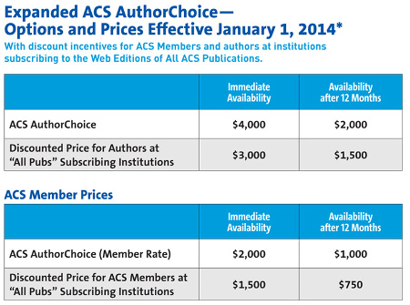
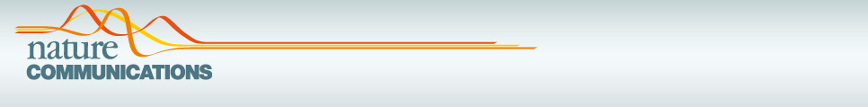
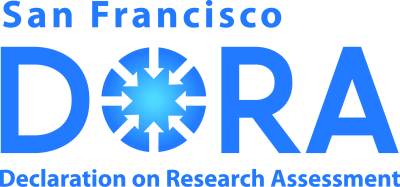

# Open Science
Gavin L. Simpson  
November 5, 2014  

## Open Science

- The most other scientists see of your research is the paper at the end
- Yet even this is not accessible to many scientists or the public
- More than just access to the published results
    - Data?
    - Methods?
    - Code?
    - Statistics?
    - Hypotheses?

## Open Access

- Who owns copyright on the average paper in a standard journal?

## Open Access

- Almost certainly not the authors!
- Rights transferred to publisher
- OA is about retaining your rights & maximizing access to research outputs

## Open Access

<video src="http://upload.wikimedia.org/wikipedia/commons/7/71/PhD_Comics_Open_Access_Week_2012.ogv" width="853" height="480" controls></video>

&copy; [Piled Higher & Deeper Publishing LLC](http://www.phdcomics.com/tv/#015) --- CC BY

## Models

- Two main models
    - Gold
    - Green

## Gold OA

- Publish in an OA journal
- Immediate & open access to published version
- Often authors incur an APC
- But majority of OA journals charge no APCs

## Green OA

- Self-archiving
- Upon being accepted, deposit authors version in a repository
    - Institutional
    - Domain specific
- Usually, journals impose an embargo period
- Important to check what journals allow you to do
    - after all you've signed away copyright!

## Hybrid Journals

- Another type of publishing model
- Allows OA within otherwise closed journal
- Involves payment of APCs
- Allows traditional venues for papers&hellip;
- &hellip;but supports big STEM publishers

## Licences

- Open Access is largely a copyright issue
- Author owns the copyright on their works --- "awarded" at point of creation
- Right up to the point the author signs it over
- What others can & can't do with your works depends on licence terms

## Creative Commons

- Creative Commons or CC licences are very common in OA publishing
    - BY --- By attribution
    - SA --- Share-alike
    - NC --- Non-commercial
    - ND --- No derivatives

## CC-BY

- The most permissive of the CC copyright licenses
- Anyone can reuse a work, do anything with it, so long as they attribute the original source

## Berlin declaration

> "&hellip;a free, irrevocable, worldwide, right of access to, and a license to
> copy, use, distribute, transmit and display the work publicly and to
> make and distribute derivative works, in any digital medium for any
> responsible purpose, subject to proper attribution of authorship&hellip;"

[Berlin Declaration on Open Access to Knowledge in the Sciences and Humanities](http://openaccess.mpg.de/286432/Berlin-Declaration)

## CC-BY-SA

- This adds a share-alike clause to the licence
- *viral*
- Derived works must also be licensed under

## CC-BY-ND

- Adds a no-derivatives clause to CC-BY
- Prevents remixing, combining etc of your work

## CC-BY-NC

- Adds a non-commercial clause to CC-BY
- But what is NC?

> "Any use, that is primarily directed toward commercial advantage or
> private monetary compensation" Paul Kimpel

## CC-BY-NC-SA & CC-BY-NC-ND

- CC-BY-NC-SA --- Combines the NC and SA clauses
- CC-BY-NC-ND --- Combines the NC and ND clauses

## APCs

- Article Processing Charges
- What you pay to the publisher to cover their costs of publishing & making available your manuscript
- What you pay varies widely
- Majority of OA don't charge any APCs

## From the free (beer)&hellip;

- Many Gold OA journals *do not* charge APCs

## &hellip;to the sublime&hellip;

- The PeerJ has an author subscription model
- $99 / $199 / $299 1-off fee
- 1 / 2 / unlimited pubs in journal
- All authors on a paper need a subscription

## &hellip;to the ridiculous

- American Chemical Society OA APCs
- Additional $1000 for CC licences

## &hellip;yet more silliness, this time from AAAS

<iframe width="560" height="315" src="http://www.youtube.com/embed/G6HwSL1vE0c" frameborder="0" allowfullscreen></iframe>

## &hellip;yet more silliness, this time from AAAS

- APC of $3000 (CC-BY-NC) or $4000 (CC-BY)
- Online online journal but discourages properly documenting research
    - $1500 surcharge for > 15 pages!
- 115 like-minded people wrote a letter denouncing the AAAS over *Science Advances*
    - Tennant *et al* Open Letter to AAAS. *The Winnower* 1:e140813.35294 (2014)

[DOI](http://doi.org/10.15200/winn.140813.35294)

## Nature Publishing Group get in on the act&hellip;

- Nature Communications *was* a hybrid OA -- subscription-based, online-only journal
- Papers published "*&hellip;represent important advances of significance to specialists within each field*"
- Recently went Open Access only [http://doi.org/10.1038/ncomms6523]()
- APC a *staggering* **$5200 + taxes**
- Default licence is CC-BY (but allows CC-BY-NC-ND or CC-BY-NC-SA)
- Paying (in part) to support the 30+ staff NPG employ to run the journal

 

## Rise of the mega journals

- New journals like PLOS One, Scientific Reports
- Lower APCs that traditional publishers
- APC of $1350
- PLOS One will also waive fees if no funding source
- Mega journals often have different review criteria; work required to only be *technically sound*

## Preprint servers

- Preprint servers allow rapid dissemination of your work *before* peer review
- Very popular in mathematics, physics, statistics; [arXiv.org](http://arxiv.org)
- Biological communities well-served now by
    - [PeerJ Preprints](http://peerj.com/preprints/)
    - [bioRXiv](http://biorxiv.org)
- Check your intended journal accepts papers that have preprints --- some don't but most now do, including *Nature* etc.

## Open Access at U of R

- Library has an Open Access team to assist you
- Web pages have a [lot of useful information](http://www.uregina.ca/copyright/open-access/index.html)
- **Authors Fund** --- can apply to the fund for costs associated with APCs
    - Only for fully-OA journals (not hybrids)
    - Must deposit copy of work in *oURspace*, the U of R's institutional repository
    - Work must not be embargoed

## Tri-council Open Access policies

- CIHR has an Open Access policy
    - All research papers from CIHR-funded work *must* be available freely from the publisher or other online repository within 12 months of publication
- NSERC, SSHRC proposed draft policy in fall 2013 to bring them in to line with CIHR
- Summary of consultation on draft policy now [available](http://www.nserc-crsng.gc.ca/NSERC-CRSNG/policies-politiques/OpenAccess-LibreAcces_eng.asp); a decision should come this fall
- Open Access is coming whether you like it or not!

## Open Access "sting"

- Science (October 2013) published a [news piece by John Bohannon](http://doi.org/10.1126/science.342.6154.60)
- "*Dozens of open-access journals targetted in an elaborate **Science** sting accepted a spoof research article, raising questions about peer-review practices in much of the open-access world*"
- Beal's list of *predatory publishers*
    - Spam emails
    - Grammatical errors or typos
    - Editorial boards &hellip;
- Be careful who you publish with
- Consult with Librarian or peers

 

- Not restricted to **Open Access**

## Fake peer reviews

Publisher discovers 50 manuscripts involving fake peer reviews&hellip;

## Open Data

- Data is the *life blood* of science
- Impossible to reproduce or check results without access to data
- Hogging data promotes duplication of effort

## Data journals

- Rise of a new breed of journal, e.g.
    - Scientific Data
    - Geoscience Data Journal
- Focus on papers that describe data
- Descriptions and meta data

## Data journals

<iframe width="560" height="315" src="http://www.youtube.com/embed/hrHM3bUym3g" frameborder="0" allowfullscreen></iframe>

## Data Repositories

- Not enough to just describe data
- Data journals also mandate that data be deposited in approved repositories
- Data deposits don't need to be tied to a (data) paper
- Examples
    - Dryad
    - figShare

## Data licenses

- Common to place data in public domain
- Can be done via another CC "licence"
- CC Zero

## Open Code

- Even in less-technical subjects, computers pervade the scientific endeavour
- How to check that you didn't make a mistake
    - coding data?
    - data processing?
    - applying a statistical analysis?
- Can we truly trust results of research without access to the codes?

## How to be open with code?

- Use open source software
- Use scripts to document data processing/analysis steps
- Use permissive licences (GPL, MIT, BSD, Apache)
- Release your code in convenient form
- Use version control (e.g. github)

## Reproducibility

- Much of Open Science is about reproducibility and trust
- Reproducibility is the *essence* of science
- Amgen tried to replicate 53 landmark studies in basic cancer research ([Begley & Ellis, 2012](http:doi.org/10.1038/483531a))
- They could reproduce just *6*

## Lab notebooks

- Many of us keep a lab notebook for details of experiments, ideas, notes
- Growing number of people now keeping fully open lab notebooks on the web
     - [Carl Boettiger's Lab notebook](http://carlboettiger.info/lab-notebook.html)
- Pinnacle of openness & transparency

## Misc.

- What to do posters, images, presentations etc?
- [figShare](http://figshare.com) is one answer to this
- [slideshare](http://http://www.slideshare.net) is another for presentations
- You can essentially upload anything, for free to figShare

## Social Media

- Many scientists have a social media "presence"
- Many reasons
     - Advertise/discuss their work
     - Comment on new findings
     - Provide lay-person explanations of their work
     - Discuss topics with colleagues

## Many social medias

- Twitter
- Google+
- Facebook
- Lab or personal blogs
- Website
- &hellip;

## Social media

- Find something that works for you
    - E.g. use twitter just to announce blog posts or a new paper
- Remember; a post or tweet is not just for Christmas, it is forever!
- Do it for fun, not because you "have" to

## Blogging

- Weblogs or blogs are a useful way of keeping a lab or personal academic website
- Post information about new papers, projects, etc.
- You don't need to post regularly
- Very useful tool for presenting your research
    - why it is important?
    - What it means?
- An alternative lab notebook

## Altmetrics

- Mentioned *impact factors* & how useless they are as a measure of an individual's impact
- *Altmetrics*: article level metrics
    - Viewed; page views & PDF downloads
    - Saved; social bookmarks ([Mendeley](http://www.mendeley.com/), [Cite-U-Like](http://www.citeulike.org/))
    - Cited; traditional citations ([CrossRef](http://www.crossref.org/), [WoS](http://thomsonreuters.com/web-of-science/), [Scopus](http://www.scopus.com/))
    - Discussed; blog posts, journal comments, tweets, etc.
    - Recommended; other recommendations
- [Altmetric](http://www.altmetric.com), [ImpactStory](http://impactstory.org)

[Source: Wikipedia](http://en.wikipedia.org/wiki/Altmetrics)

## *Really* assessing impact

Putting science into the assessment of research

DORA: [http://am.ascb.org/dora/]()

## Getting credit --- ORCIDs

- ORCID, an open, non-profit, community-driven effort to create a database of unique researcher identifiers
- Facilitates linking research activities & outputs to ORCID identifiers
- **Get one** & use it when you submit papers, provide peer-review, etc.

My ORCID iD: [0000-0002-9084-8413](http://orcid.org/0000-0002-9084-8413)

 
 
 

## A dialogue

- Many of you won't be the only person with an interest in your research
- Important to find approach that works for you *and* your collaborators & supervisors
- Have a conversation with these people at the start of your research or project
- Agree what you will and won't allow open access to or when you'll allow access

## Credit & reuse

Slides &copy; Gavin Simpson 2013--14 [CC-BY](http://creativecommons.org/licenses/by/4.0/)

Creative Commons logos &copy; [Creative Commons CC-BY](http://creativecommons.org/about/downloads)

PhD Comics Video &copy; [Piled Higher & Deeper Publishing LLC CC-BY](http://www.phdcomics.com/tv/#015)

](6051663917_9d3bd88f70.jpg)

